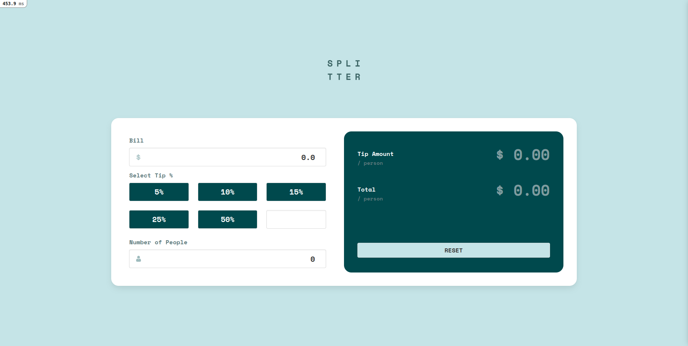
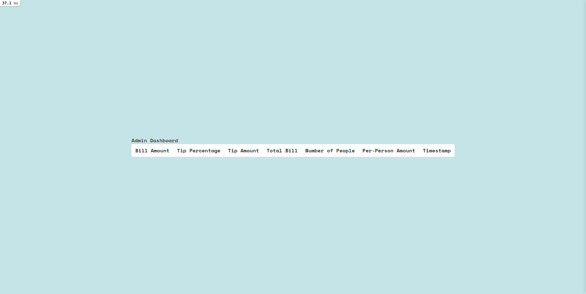

# Tip Calculator Challenge

Welcome to the **Tip Calculator Challenge**! This Ruby on Rails application is a web-based tip calculator with an additional **Admin Dashboard** to track past tip calculations. The project demonstrates the use of Ruby on Rails for building functional, user-friendly applications while maintaining clean, maintainable code.

## Features

### Core Functionality
- **Tip Calculation**: Users can calculate the tip and total bill amount based on their input.
- **Per-Person Amount**: Calculate the per-person share for group bills.

### Additional Functionality
- **Admin Dashboard**:
  - Accessible at `/admin`.
  - Displays all previous tip calculations with the following details:
    - **Bill Amount**
    - **Tip Percentage**
    - **Tip Amount**
    - **Total Bill**
    - **Number of People**
    - **Per-Person Amount**
    - **Timestamp** of the calculation.

## Setup

You can run the application using Docker (recommended) or set it up directly on your local machine. Follow the instructions below for your preferred method.

---

### Option 1: Using Docker (Recommended)

1. **Clone the Repository**:
   ```bash
   git clone git@github.com:your-username/tip-calculator-challenge.git
   cd tip-calculator-challenge
   ```

2. **Build the Docker Container**:
   ```bash
   docker-compose build
   ```

3. **Setup the Database**:
   ```bash
   docker-compose run --rm app bin/rails db:setup
   ```

4. **Start the Application**:
   ```bash
   docker-compose up
   ```

5. **Access the Application**:
   - Tip Calculator: [http://localhost:3000](http://localhost:3000)
   - Admin Dashboard: [http://localhost:3000/admin](http://localhost:3000/admin)

---

### Option 2: Without Docker (Direct Local Setup)

1. **Prerequisites**:
   Ensure you have the following installed:
   - Ruby (version 3.0.0)
   - Rails (version 6.1.4)
   - SQLite3 (bundled with most Ruby installations)

2. **Clone the Repository**:
   ```bash
   git clone git@github.com:your-username/tip-calculator-challenge.git
   cd tip-calculator-challenge
   ```

3. **Install Gems**:
   Run the following command to install required Ruby gems:
   ```bash
   bundle install
   ```

4. **Setup the Database**:
   SQLite is already configured in the `config/database.yml` file, so no changes are needed.
   Run the following commands to create, migrate, and seed the database:
   ```bash
   rails db:create db:migrate db:seed
   ```

5. **Start the Application**:
   ```bash
   rails server
   ```

6. **Access the Application**:
   - Tip Calculator: [http://localhost:3000](http://localhost:3000)
   - Admin Dashboard: [http://localhost:3000/admin](http://localhost:3000/admin)

## Approach

### Problem-Solving
- Replicated the functionality of the **Frontend Mentor Tip Calculator** by implementing input-based calculations for bill splitting and tip calculations.
- Added a database-backed **Admin Dashboard** to track and display all previous tip calculations.

### Technologies Used
- **Ruby on Rails**: Framework for building the application.
- **PostgreSQL**: Database to store tip calculation records.
- **Docker**: Containerized setup for easy local development.
- **RSpec & Jest**: For testing the backend and frontend functionality.

## Testing

To ensure the application functions correctly, follow these steps:

1. **Start the Application**:
   ```bash
   docker-compose up
   ```

2. **Run Backend Tests**:
   - **Setup the Test Database**:
     ```bash
     docker-compose run -e "RAILS_ENV=test" app rake db:create db:migrate
     ```
   - **Run All Tests**:
     ```bash
     docker-compose run -e "RAILS_ENV=test" app rails test
     ```
   - **Run Individual Tests**:
     ```bash
     docker-compose run -e "RAILS_ENV=test" app rspec spec/path/to/spec.rb
     ```

## Screenshots



## Resources

- [Ruby on Rails Guides](https://guides.rubyonrails.org/)
- [Frontend Mentor Tip Calculator](https://www.frontendmentor.io/challenges/tip-calculator-app-ugJNGbJUX)
- [Docker Documentation](https://www.docker.com)
